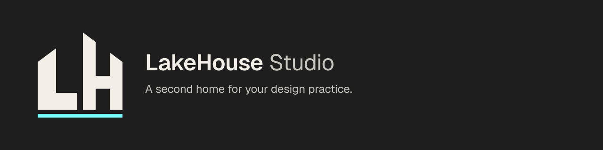

  

<em>A second home for your design practice.</em>

# .github

**LakeHouse Studio** org-wide shared defaults for a modular digital office for designers and agents. Public work uses **Template-Widget** (LakeHouse-extensible widgets) or **Template-OpenSource** (general OSS, no widget concepts). The private monorepo is the host. This repository holds community health files, release and SEO standards, the brand kit, and reusable workflows both public templates inherit.

Sen reviews and merges. ZERO COST / GitHub Free. Do not merge without Sen.

Identity and public domain: [`.lakehouse/org.json`](.lakehouse/org.json). Pins: [`.lakehouse/pins.json`](.lakehouse/pins.json). Brand kit v0.3: [`brand/`](brand/) (dark only, accent `#7DFFFF`, Geist / Geist Mono).

## Contents

| Path | Purpose |
| --- | --- |
| [profile/README.md](profile/README.md) | Org profile README (header + tagline) |
| [brand/](brand/) | Brand kit v0.3 (tokens, writing, final assets) |
| [CITATION.cff](CITATION.cff) | Citation metadata |
| [docs/naming.md](docs/naming.md) | Four templates + which-template guide |
| [docs/merge-queue.md](docs/merge-queue.md) | Public merge queue vs private manual merges |
| [docs/deploy/vercel-env.md](docs/deploy/vercel-env.md) | Vercel shared vs project env vars |
| [docs/deploy/secrets-inventory.template.md](docs/deploy/secrets-inventory.template.md) | Secrets inventory (names only) |
| [docs/deploy/secrets-rotation-checklist.md](docs/deploy/secrets-rotation-checklist.md) | Rotation checklist |
| [docs/discoverability.md](docs/discoverability.md) | Descriptions, topics, pins, profile strategy |
| [docs/docs-site.md](docs/docs-site.md) | Astro Starlight org docs decision |
| [docs/seo-checklist.md](docs/seo-checklist.md) | Reusable SEO checklist |
| [docs/search-and-analytics.md](docs/search-and-analytics.md) | Search Console, Bing, analytics (Sen) |
| [docs/launch-checklist.md](docs/launch-checklist.md) | Launch channels checklist |
| [docs/awesome-lists.md](docs/awesome-lists.md) | Awesome-list submission guide |
| [CONTRIBUTING.md](CONTRIBUTING.md) | Contributor guide + writing rules |
| [GOVERNANCE.md](GOVERNANCE.md) | Response times, stale policy, Discussions |
| [ROADMAP.md](ROADMAP.md) | Direction for contributors |
| [docs/starter-issues.md](docs/starter-issues.md) | Seed 3-5 good-first issues |
| [docs/contributor-listings.md](docs/contributor-listings.md) | up-for-grabs, goodfirstissue.dev, … |
| [docs/maintainer-playbook.md](docs/maintainer-playbook.md) | Safe review of outside PRs |
| [docs/releasing.md](docs/releasing.md) | Tags, changesets, notes, rollback |
| [docs/pre-release-checklist.md](docs/pre-release-checklist.md) | Before Sen publishes a release |
| [docs/repo-metadata.md](docs/repo-metadata.md) | Short metadata checklist |
| [docs/media-convention.md](docs/media-convention.md) | `docs/media/` for templates |
| [docs/sen-only-github-settings.md](docs/sen-only-github-settings.md) | UI settings only Sen changes |
| [AGENTS.md](AGENTS.md) / [CLAUDE.md](CLAUDE.md) | House rules + Never do |
| [workflow-templates/](workflow-templates/) | Starter workflows |
| [scripts/](scripts/) | Node `.mjs` tools |
| [`.devcontainer/`](.devcontainer/) | Codespaces / Dev Container |

## Quick policies

- Public → GitHub-hosted runners; private → self-hosted; never self-hosted on public.
- Merge commits only; public repos use the merge queue on `main`.
- Epics: [SenZhang-Plus/SenZhang-Todo](https://github.com/SenZhang-Plus/SenZhang-Todo).
- Do not hardcode the GitHub org login. Use `org.json` or `${{ github.repository_owner }}`.
- Scripts for repo automation are Node `.mjs` (not bash). Brand kit builders are Python (`brand/build_*.py`).
- Dark mode only; single accent `#7DFFFF`. Writing: [brand/WRITING-STYLE.md](brand/WRITING-STYLE.md).

## Contributors

<!-- ALL-CONTRIBUTORS-BADGE:START - Do not remove or modify this section -->

<!-- ALL-CONTRIBUTORS-BADGE:END -->

Thanks goes to these wonderful people ([emoji key](https://allcontributors.org/docs/en/emoji-key)):

<!-- ALL-CONTRIBUTORS-LIST:START - Do not remove or modify this section -->
<!-- prettier-ignore-start -->
<!-- markdownlint-disable -->
<!-- markdownlint-enable -->
<!-- prettier-ignore-end -->
<!-- ALL-CONTRIBUTORS-LIST:END -->

This project follows the [all-contributors](https://allcontributors.org) specification. Contributions of any kind welcome!
